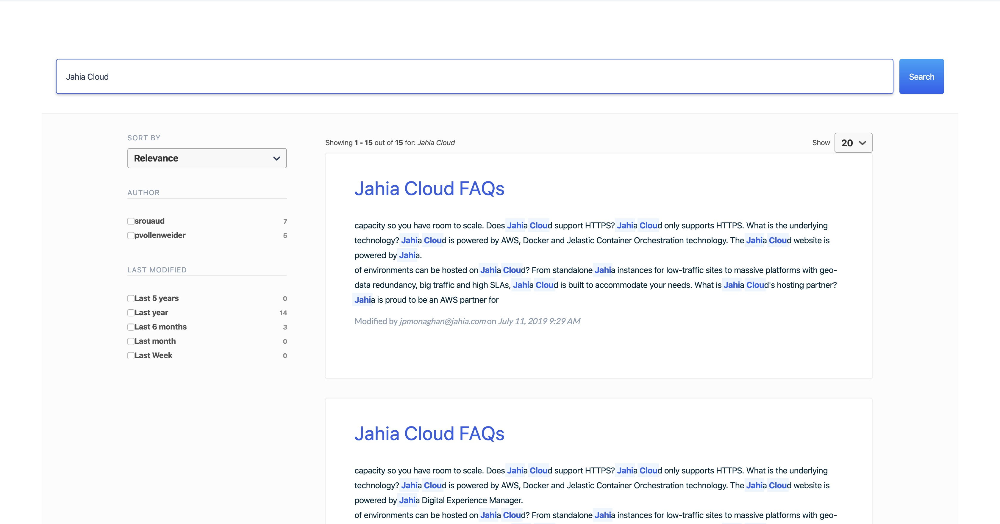

|  | Badges | 
| --- | --- |
| Module |   |
| Tests |  |
| CI / CD |      |
| Artifacts |   |
| Slack |  |

Augmented Search UI
==========================

This repository is a sample UI module to integrate Jahia Augmented Search in your site. You can use it as the starting point to customize your search experience.

## Table of content

- [Presentation](#presentation)
- [Development](#development)
- [Production](#production)

## Presentation

This module provides an easy way to quickly integrate Augmented Search in your project and provides a reference implementation to base your integration upon.

You can find more details on how to integrate this module in your site on [Jahia Academy](https://academy.jahia.com/documentation/developer#augmented-search).

If you want to customize the module, more details about our GraphQL API for augmented search is [available here](https://academy.jahia.com/documentation/developer/augmented-search/2.1/querying/writing-a-query#top).

Augmented Search is available on [Jahia App Store](https://store.jahia.com/contents/modules-repository/packages/Augmented%20Search.html)

## Development

* Run `yarn` to install dependencies
* Makes sure to link/copy `search-ui-jahia-connector` to your development version
* Deploy module on Jahia
* Add module to Academy website
* Publish Academy
* Create a page with `Free` template and add `search-ui` component
* Change server name to `localhost`   

## Production

Download the module from store.jahia.com and deploy it on your platform
